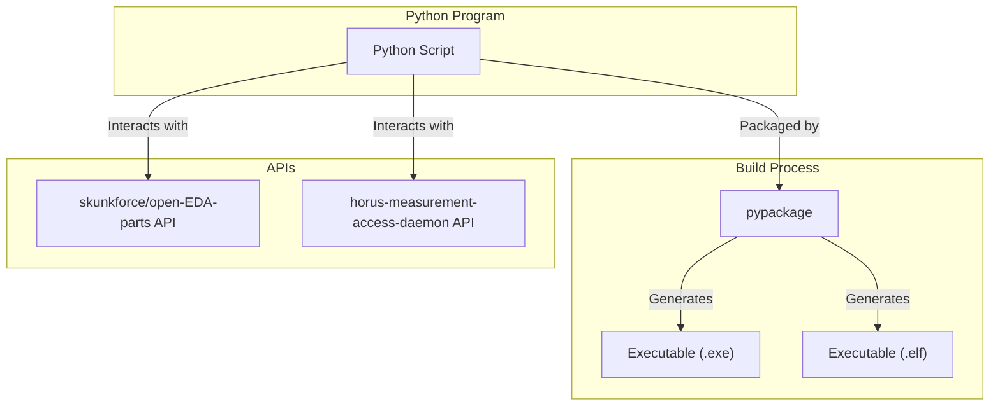

# gp_horus-cli_sw
This python tool allows you to interact with the GlobalPoint HORUS measurement-access-daemon API (short MAD) in a convenient way from your command-line without unnecessary dependencies.

It's purpose is two-fold:

1. To provide a scriptable way to interact with the MAD 
2. To provide an example on how you can use the MAD API for your own integrations

Here is a little graph, that shows how gp_horus-cli_sw works:


## Usage
Download the executable and install it into your system-path.
Open up a terminal and run:
```
horus-cli --help
```
to see the available options.
It can be run batch-mode or interactively.


### Parts-Managment
HORUS-CLI allows for easy manipulation of the parts-library.

#### Solder-Pastes
Show all installed solder-pastes:
```
horus-cli --ip <MAD-IP> --port <MAD-PORT> pppman sp list all
```

Add a solder-paste from JSON-File:
```
horus-cli --ip <MAD-IP> --port <MAD-PORT> pppman sp add <JSON-FILE>
```

Delete a solder-paste:
```
horus-cli --ip <MAD-IP> --port <MAD-PORT> pppman sp del <UUID>
```

Export a solder-paste:
```
horus-cli --ip <MAD-IP> --port <MAD-PORT> pppman sp export <UUID> --output <target-file.zip>
```

## Building
The gp_horus-cli_sw can be packaged to an executable for Windows and Linux. 
Currently this step is not yet automated in our CI/CD pipeline.